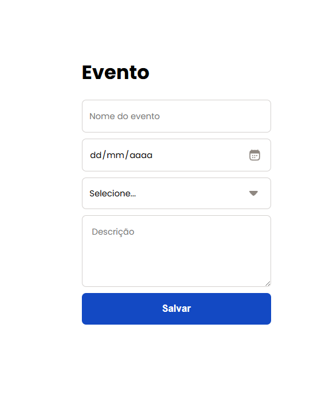

# 🗓️ Formulário de Evento com Validação (React + TypeScript)

Projeto desenvolvido para estudo de **validação de formulários** em React, utilizando **React Hook Form**, **Yup** e **TypeScript**.

## 🚀 Objetivo

Explorar boas práticas de criação e validação de formulários, incluindo:
- Controle de campos com **Controller**
- Tipagem do formulário com **TypeScript**
- Validação de dados com **Yup**
- Manipulação dos eventos `onChange` e `onSubmit`

## 🧩 Tecnologias utilizadas

- [React](https://react.dev/)
- [TypeScript](https://www.typescriptlang.org/)
- [React Hook Form](https://react-hook-form.com/)
- [Yup](https://github.com/jquense/yup)
- [Vite](https://vitejs.dev/)

## 🖥️ Funcionalidades

- Cadastro de eventos com nome, data, categoria e descrição  
- Validação de campos obrigatórios  
- Mensagens de erro personalizadas  
- Formulário controlado com tipagem segura  

## 📸 Prévia



## ⚙️ Como executar

```bash
# Clonar o repositório
git clone https://github.com/seuusuario/formulario-validacao-react.git

# Entrar na pasta do projeto
cd formulario-validacao-react

# Instalar as dependências
npm install

# Iniciar o servidor de desenvolvimento
npm run dev
